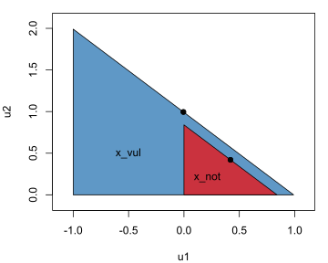
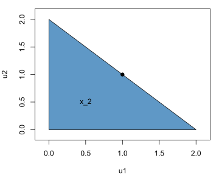

This post continues my [first post](https://skranz.github.io/r/2019/12/10/RelationalContractsBlog1.html) on game theoretic analysis with the package [RelationalContacts](https://skranz.github.io/RelationalContracts/) in R. Here we look at more complex infinite horizon games with endogenous states. I also illustrate how one can explicitly combine relational contracting and hold-up concerns.

The following code specifies a game with 3 states:

```r
library(RelationalContracts)
g = rel_game("Mutual Gift Game with Endogenous Vulnerability") %>%
  rel_param(vul=1, delta=0.3) %>%
  rel_state("x_0",
    A1 = list(move=c("vul","not")),
    pi1 = 0,
    pi2 = 0
  ) %>%
  rel_transition("x_0","x_not",move="not",prob = 1) %>%
  rel_transition("x_0","x_vul",move="vul",prob = 1) %>%
  rel_state("x_not",
    A1 = list(e1=seq(0,1,by=0.1)),
    A2 = list(e2=seq(0,1,by=0.1)),
    pi1 = ~ e2 - 0.5*e1^2,
    pi2 = ~ e1 - 0.5*e2^2
  ) %>%
  rel_state("x_vul",
    A1 = list(e1=seq(0,1,by=0.1)),
    A2 = list(e2=~c(-vul,seq(0,1,by=0.1))),
    pi1 = ~ e2 - 0.5*e1^2,
    pi2 = ~ e1 - 0.5*pmax(e2,0)^2
  )
```
In an initial state `x_0` player 1 decides whether he wants to be permanently vulnerable and transit to state `x_vul`. Alternatively, he remains not vulnerable and transits to state `x_not`. 

In states `x_vul` and `x_not` players play a variation of an infinitely repeated prisoners' dilemma. Each player can choose effort on a grid between 0 and 1 that benefits the other player but involves own cost. Higher effort increases joint payoffs, but in the Nash equilibrium of the one shot game, both players choose 0 effort. In state `x_vul` the game is extended in so far that player 2 can costlessly hurt player 1. More precisely, player 2 can choose negative effort at zero cost that reduces player 1 stage game payoff by `vul=1`.

We have studied these two repeated games with exogenously given vulnerability already in the [first part](https://skranz.github.io/r/2019/12/10/RelationalContractsBlog1.html) of the blog. Recall that vulnerability allows to implement higher effort levels:

```r
g = rel_spe(g)
get_eq(g) %>%
  select(x,ae.lab,U,v1,v2) %>%
  filter(x != "x_0")
```

```
## # A tibble: 2 x 5
##   x     ae.lab        U    v1    v2
##   <chr> <chr>     <dbl> <dbl> <dbl>
## 1 x_not 0.6 | 0.6  0.84     0     0
## 2 x_vul 0.9 | 0.9  0.99    -1     0
```

For a discount factor of $\delta=0.3$, we can implement efforts of $e_1=e_2=0.6$ without vulnerability, and efforts of $e_1=e_2=0.9$ with vulnerability. Vulnerability allows higher equilibrium effort because a deviation to zero effort can be more strongly be punished in the future. It is a common insight in the game theoretic analysis of relational contracts that stronger punishment opportunities allow to incentivize more cooperative behavior on the equilibrium path. 

Here are the sets of (average discounted) SPE continuation payoffs in states `x_vul` and `x_not`:

```r
plot_eq_payoff_set(g,x = c("x_vul","x_not"))
```

<!-- -->

Here $u_1$ and $u_2$ denote player 1's and 2's payoffs respectively. Note that we assume for all games studied in this post that at the beginning of each period players can perform voluntary monetary transfers and that players are risk neutral. This causes SPE payoff sets to have such a simple triangular structure.

The black dots mark the equilibrium payoff that would be selected if players picked a continuation payoff via Nash bargaining assuming the worst SPE continuation payoff is the disagreement point. While vulnerability allows more effective cooperation, it deteriorates player 1's bargaining position so much that he would be worse off should those Nash bargaining solutions be selected as continuation equilibria.

But our game starts in state `x_0` where player 1 can freely choose whether to be permanently vulnerable or not. Before continuing our analysis, let me insert a little quiz and questionnaire:

<iframe src="https://docs.google.com/forms/d/e/1FAIpQLSd9eP9YjdWC3k8kFCHmS_dPhPS14_S-Oya1sNXUQbtWkEuuBw/viewform?embedded=true" width="640" height="703" frameborder="0" marginheight="0" marginwidth="0">Loading…</iframe>

Let us take a look at the computed optimal simple equilibrium.

```r
get_eq(g) %>%
  select(x,ae.lab)
```

```
## # A tibble: 3 x 2
##   x     ae.lab   
##   <chr> <chr>    
## 1 x_0   "vul | " 
## 2 x_not 0.6 | 0.6
## 3 x_vul 0.9 | 0.9
```

We see from the first row that player 1 makes himself vulnerable in the initial state `x_0`. Indeed, one can show that in *every* Pareto-optimal SPE player 1 will make herself vulnerable. Why is player 1 willing to do that even though being vulnerable would put him in a bad position if the future of their relationship would be newly negotiated? The answer is simply that the concept of Pareto-optimal SPE assumes that relational contracts will not be newly negotiated in period 2 or at any time later during the relationship.

In particular any implicit or explicit threats by player 2 of the form, "Give me more money or I will exploit your vulnerability and hurt you!", are futile by assumption. The incentive constraints imposed by subgame perfection are weak enough to allow players to coordinate to ignore such threats. While players can agree on punishment that uses player 1's vulnerability should he deviate from cooperative behavior on the equilibrium path, players can also agree to never exploit the vulnerability otherwise. Is this prediction plausible? In my opinion not.

In our [recent paper](https://papers.ssrn.com/sol3/papers.cfm?abstract_id=2210603), my co-author Susanne Goldluecke and me refer to the prediction that player 1 makes himself vulnerable in every Pareto-optimal SPE as the *Vulnerability Paradox* of Pareto-optimal SPE.

We introduce an new concept called *Repeated Negotiation Equilibrium* (RNE). The key idea is that parties from time to time newly negotiate the terms of their relationship. While past agreements are not automatically void after one period, current relative bargaining positions do matter and shape current and future interactions.

To formalize this idea in a tractable fashion, we assume that there is an exogenous probability $\rho \in [0,1]$ that an existing relational contract is newly negotiated at the beginning of a period. If there is a new negotiation, continuation payoffs are selected via [Nash bargaining](https://en.wikipedia.org/wiki/Bargaining_problem) given the set of continuation payoffs (accounting for future negotiation payoffs and taking the lower left point as disagreement point).

Consider the case in our example that player 1 made himself vulnerable. If new negotiations take place, player 1 then suffers from his weak bargaining position. Yet, as long as no new negotiations take place, players can stick to an agreement not to exploit player 1 weaker bargaining position. So for some random duration (that is longer in expectation for lower negotiation probabilities $\rho$) player 1's vulnerability will not be exploited. But at some point of time the relationship will be newly negotiated and then the vulnerability harms player 1. 

The following code solves our game first for a high and then for a low negotiation probability:

```r
rel_rne(g,adjusted.delta = 0.3, rho=0.5) %>%
  get_eq() %>%
  select(x,ae.lab)
```

```
## # A tibble: 3 x 2
##   x     ae.lab   
##   <chr> <chr>    
## 1 x_0   "not | " 
## 2 x_not 0.6 | 0.6
## 3 x_vul 0.9 | 0.9
```

```r
rel_rne(g,adjusted.delta = 0.3, rho=0.1) %>%
  get_eq() %>%
  select(x,ae.lab)
```

```
## # A tibble: 3 x 2
##   x     ae.lab   
##   <chr> <chr>    
## 1 x_0   "vul | " 
## 2 x_not 0.6 | 0.6
## 3 x_vul 0.9 | 0.9
```

We see from the rows corresponding to state `x_0` that player 1 makes himself vulnerable only under the low negotiation probability (`rho=0.1`). Under a high negotiation probability (`rho=0.5`) player 1 does not make himself vulnerable because new negotiations in which player 1 will suffer from his weak bargaining position are expected to happen too soon.

In the corner case of a zero negotiation probability ($\rho=0$) an RNE is simply a Pareto-optimal SPE.

The opposite corner case of ($\rho=1$) means the relational contract will be newly negotiated every period. Then there is no scope for relational contracting since informal past agreements are always ignored. This is essentially the behavioral assumptions of [hold-up models](https://en.wikipedia.org/wiki/Hold-up_problem). The crucial element of hold-up is that the terms of the relationship will be newly negotiated after some long term decisions have been made. In our [paper]((https://papers.ssrn.com/sol3/papers.cfm?abstract_id=2210603)), we discuss in detail how our model combines the relational contracting and hold-up literatures and provides intuitive insights that don't arise in these corner cases.

You may wonder why in the code above, we have specified an adjusted discount factor `adjusted.delta` instead of a discount factor `delta`. The reason is that in repeated games, i.e. games with a single unchanging state, a positive negotiation probability is essentially equivalent to a lower discount factor. For example, if we have a discount factor of $\delta=0.7$ and a negotiation probability of $\rho=0.4$, the game has the same equilibria as if we had an adjusted discount factor of $$\hat \delta = \delta (1-\rho) = 0.42.$$ I often prefer comparative statics where I keep the adjusted discount factor constant when changing the negotiation probability.

## <a id="gradual">Gradually intensifying relationship</a>

I want to show you a more complex variation of our example, where Pareto optimal SPE are unintuitive while positive negotiation probabilities yield more intuitive results.

We assume both players can make themselves more vulnerable over time in small or bigger steps. More precisely, a state consists of a pair $(x_1,x_2)$ where $x_i\in \{0,0.05, 0.1, ..., 0.5\}$ measures player $i's$ vulnerability. Via an the action `to_x1` (player 1) or `to_x2` (player 2) a player can in every period keep his current vulnerability level or increase to any higher level. But vulnerabilities can never decrease. 

To improve numerical tractability, we assume that a period has two action stages. First effort levels are chosen, which don't impact state transitions and are therefore called static actions. Future vulnerability levels are chosen afterwards. We also assume that transfers are possible before every stage.

It is more convenient to specify this game via functions that determine action spaces, payoffs and state transitions: 

```r
# Define action spaces for static actions
# that don't affect state transitions
# Here efforts
static.A.fun = function(x1,x2,e.seq=c(0,1),...) {
  restore.point("static.A.fun")
  list(
    A1=list(e1=unique(c(-x2,e.seq))),
    A2=list(e2=unique(c(-x1,e.seq)))
  )
}

# Payoffs from static actions
# We use a vectorized version that computes payoffs
# for all combinations of state and action profiles
# corresponding to the rows of ax.df
static.pi.fun = function(ax.df, cost=1/2,...) {
  restore.point("pi.fun")
  mutate(ax.df,
     pi1 = e2 - 0.5*pmax(e1,0)^2,
     pi2 = e1 - 0.5*pmax(e2,0)^2
  )
}


# Action spaces for actions that affect state transitions
# Players pick a weakly higher vulnerability level
A.fun = function(x1,x2,x.seq,...) {
  restore.point("A.fun")
  list(
    A1=list(to_x1=x.seq[x.seq>=x1]),
    A2=list(to_x2=x.seq[x.seq>=x2])
  )
}

# State transitions
# We must a return a data frame with columns
# xs (source state)
# xd (destination state)
# prob the probability that this transition takes
#      place
# actions named with value for which this transition
#      takes place, here to_x1 and to_x2 which
#      are already given in ax.df 
trans.fun = function(ax.df,x.seq, ...) {
  restore.point("trans.fun")
  ax.df %>%
    select(xs=x, to_x1, to_x2) %>%
    unique %>%
    mutate(xd = paste0(to_x1,"_", to_x2), prob=1)
}

# Specfiy state space
# 
# x.df has a column x that is a unique identifier
# for each state
# it can have aditional columns like x1 and x2
# that contain information about states and will
# be part of the ax.df that will be passed as argument
# to the functions above
x.seq = seq(0,0.5, by=0.05)
x.df = as_tibble(expand.grid(x1=x.seq,x2=x.seq))
x.df$x = paste0(x.df$x1,"_", x.df$x2)

# Define game
g = rel_game("Intensifying Relationship Game") %>%
  rel_param(x.seq=x.seq, e.seq=seq(0,1,by=0.05)) %>%
  rel_states(x.df,A.fun=A.fun,static.A.fun=static.A.fun, pi1=0, pi2=0, static.pi.fun=static.pi.fun, trans.fun=trans.fun)
```

It is easy to make mistakes when writing these functions, in particular `trans.fun` that determines state transitions. When developing these functions, I want to debug them and take a look at their arguments, like `ax.df` and the computed results. You could do this via the `debug` function, e.g. call `debug(trans.fun)` before specifying the game. Personally, I prefer to use restore points instead. That is why you see the call to `restore.point` at the beginning of each function. For usage, take a look the restore point [vignette](https://cran.r-project.org/web/packages/restorepoint/vignettes/Guide_restorepoint.html). 

The following code finds an optimal simple SPE (and thereby the whole SPE payoff set) for a discount factor of $\delta=0.25$.

```r
g = rel_spe(g, delta=0.25)
```


Before looking at the result, let us have another quiz:

<iframe src="https://docs.google.com/forms/d/e/1FAIpQLSdq7F0PwB-fEm8za8HPh5OIXBE3UZExAzyq6Yjs1fyXn98WKA/viewform?embedded=true" width="640" height="703" frameborder="0" marginheight="0" marginwidth="0">Loading…</iframe>

OK, here is the structure of the optimal simple equilibrium:

```r
get_eq(g) %>%
  select(x, to_x1, to_x2,e1,e2, U,v1,v2) %>%
  filter(x %in% c("0_0","0.5_0.5"))
```

```
##         x to_x1 to_x2   e1   e2        U   v1   v2
## 1     0_0   0.5   0.5 0.55 0.55 0.838125  0.0  0.0
## 2 0.5_0.5   0.5   0.5 0.80 0.80 0.960000 -0.5 -0.5
```
We see from the first row that in the initial state `0_0` both players make themselves immediately maximally vulnerable (`to_x1=0.5` and `to_x2=0.5`). Indeed, one can show that this result holds for all Pareto-optimal SPE.

Why does not a player decide to deviate and stay invulnerable and then benefit from a strong bargaining position against the other vulnerable player? Same answer as in our previous example: Pareto-optimal SPE can by assumption rule out any hold-up problem. Players just don't newly negotiate their relational contract and thus there is neither harm for a player by putting himself in a weaker future bargaining position nor a gain from putting oneself in a stronger future bargaining position. The only driver of state transitions in Pareto-optimal SPE in this example is that higher vulnerabilities allow better incentives and thus higher joint payoffs.

We now solve for a RNE assuming a negotiation probability of $\rho=0.7$ and fixing the adjusted discount factor at 0.25. 

```r
g = g %>%  rel_capped_rne(T=1000, adjusted.delta = 0.25, rho=0.7)
```

You may now wonder what the parameter `T=1000` means and why the function is called `rne_capped_rne`? It turns out that it is much easier to compute RNE if we assume that after some large number `T ` of periods either no more negotiations take place (`rel_T_rne`) or the states cannot change anymore (`rel_capped_rne`). This means, here I assumed that after period 1000, players cannot change their vulnerability anymore (but they still continue in their relationship and choose effort levels every period).

Here are the equilibrium path actions (in the first period) for the first 8 states:

```r
g %>% 
  get_eq() %>% 
  select(x1,x2, to_x1,to_x2,e1,e2) %>%
  head(8)
```

```
##     x1 x2 to_x1 to_x2   e1   e2
## 1 0.00  0  0.05  0.05 0.65 0.65
## 2 0.05  0  0.05  0.15 0.60 0.60
## 3 0.10  0  0.10  0.15 0.60 0.60
## 4 0.15  0  0.15  0.15 0.65 0.65
## 5 0.20  0  0.20  0.15 0.65 0.65
## 6 0.25  0  0.25  0.15 0.65 0.70
## 7 0.30  0  0.30  0.15 0.65 0.65
## 8 0.35  0  0.35  0.15 0.65 0.70
```

You see that with the positive negotiation probabilities players increase their vulnerabilities only in small steps.

The function `eq_diagram` is useful to illustrate equilibrium path state transitions:

```r
eq_diagram(g, just.eq.chain = TRUE,x0 = "0_0", label.fun = function(rne,...)  paste0(rne$x1, " ", rne$x2))
```

<!--html_preserve--><div id="htmlwidget-ee81e5a807c5600ad89e" style="width:480px;height:384px;" class="visNetwork html-widget"></div>
<script type="application/json" data-for="htmlwidget-ee81e5a807c5600ad89e">{"x":{"nodes":{"id":[1,2,3,4,5,6,7],"group":["node","node","node","node","node","node","node"],"label":["0 0","0.05 0.05","0.1 0.15","0.2 0.2","0.3 0.3","0.4 0.4","0.5 0.5"],"shape":["box","box","box","box","box","box","box"],"title":["0_0<br>ae: 0.65 | 0.65 | 0.05 | 0.05<br>a1: 0 | 0 | 0 | 0<br>a2: 0 | 0 | 0 | 0<br>v1=0.35 v2=0.35<br>U=0.92","0.05_0.05<br>ae: 0.6 | 0.6 | 0.1 | 0.15<br>a1: -0.05 | -0.05 | 0.05 | 0.05<br>a2: -0.05 | -0.05 | 0.05 | 0.05<br>v1=0.35 v2=0.35<br>U=0.92","0.1_0.15<br>ae: 0.65 | 0.7 | 0.2 | 0.2<br>a1: -0.15 | -0.1 | 0.15 | 0.15<br>a2: -0.15 | -0.1 | 0.1 | 0.15<br>v1=0.36 v2=0.31<br>U=0.94","0.2_0.2<br>ae: 0.65 | 0.7 | 0.3 | 0.3<br>a1: -0.2 | -0.2 | 0.2 | 0.2<br>a2: -0.2 | -0.2 | 0.2 | 0.2<br>v1=0.32 v2=0.32<br>U=0.94","0.3_0.3<br>ae: 0.7 | 0.75 | 0.4 | 0.4<br>a1: -0.3 | -0.3 | 0.3 | 0.3<br>a2: -0.3 | -0.3 | 0.3 | 0.3<br>v1=0.3 v2=0.3<br>U=0.95","0.4_0.4<br>ae: 0.75 | 0.75 | 0.5 | 0.5<br>a1: -0.4 | -0.4 | 0.4 | 0.4<br>a2: -0.4 | -0.4 | 0.4 | 0.4<br>v1=0.28 v2=0.28<br>U=0.96","0.5_0.5<br>ae: 0.8 | 0.8 | 0.5 | 0.5<br>a1: -0.5 | -0.5 | 0.5 | 0.5<br>a2: -0.5 | -0.5 | 0.5 | 0.5<br>v1=0.26 v2=0.26<br>U=0.96"],"font":["24px Arial black","24px Arial black","24px Arial black","24px Arial black","24px Arial black","24px Arial black","24px Arial black"]},"edges":{"id":[null,null,null,null,null,null],"from":[1,2,3,4,5,6],"to":[2,3,4,5,6,7],"label":["","","","","",""],"color":["#000077","#000077","#000077","#000077","#000077","#000077"],"width":[2,2,2,2,2,2],"hidden":[false,false,false,false,false,false]},"nodesToDataframe":true,"edgesToDataframe":true,"options":{"width":"100%","height":"100%","nodes":{"shape":"dot"},"manipulation":{"enabled":false},"edges":{"arrows":{"to":{"enabled":true,"scaleFactor":1}}},"physics":{"stabilization":{"enabled":true,"onlyDynamicEdges":false,"fit":true}},"layout":{"improvedLayout":true}},"groups":"node","width":null,"height":null,"idselection":{"enabled":false},"byselection":{"enabled":false},"main":null,"submain":null,"footer":null,"background":"rgba(0, 0, 0, 0)"},"evals":[],"jsHooks":[]}</script><!--/html_preserve-->
The argument `just.eq.chain = TRUE` means that only the states shall be shown that will be reached with on the equilibrium path when starting in state `x0="0_0"`.

We see how a positive negotiation probability of existing relational contracts makes player gradually and mutually increase their vulnerabilities, while Pareto-optimal SPE predict that both players make themselves immediately fully vulnerable.

For a more complex game take a look at the following [arms race example](https://skranz.github.io/RelationalContracts/articles/2_Arms_Race_Example.html) at the package website of [RelationContracts](https://skranz.github.io/RelationalContracts/).


## <a id="holdup">A classic hold-up model</a>

Wow, you are still reading this post! In the final section, we want to study a classic hold-up model using the concepts of relational contracting.

The game begins in period 1 in state `x_invest`, where player 1 chooses an investment level `inv` and bears the investment cost `0.7 * inv`. In Period 2 players can decide to trade or not. If both players agree to trade, players equally split a surplus of $S=inv$ and the game effectively ends. If not both players agree to trade, both get zero payoffs in the current period and can again decide to trade or not in the next period, and so on. 
As usual, at the beginning of each period players can transfer money to each other.

The following code specifies the game.

```r
# Vector of investment levels
# you can adapt it as you like
inv_vec = 0:2

# Specify data frame for trading states
# Needs column x but can add additional columns
# The column S denotes the surplus from trade 
x.trade.df = tibble(x=paste0("x_",inv_vec), S = inv_vec)

g = rel_game("Classic Hold-Up 2-Period Game") %>%
  # Period 1: investment takes place
  rel_state("x_invest",
    A1 = list(inv=inv_vec),
    pi1 = ~ -0.7*inv,
    pi2 = 0
  ) %>%
  # Period 2 and other periods until trading took place:
  # both players decide to trade or not
  rel_states(x.trade.df,
    A1 = list(trade1=c(FALSE,TRUE)),
    A2 = list(trade2=c(FALSE,TRUE)),
    pi1 = ~ 0.5*S*(trade1*trade2),
    pi2 = ~ 0.5*S*(trade1*trade2)
  ) %>%
  # Terminal state once trading took place:
  # no more actions no more payoffs
  rel_state("x_end",pi1 = 0,pi2 = 0) %>%
  # Transition from x_invest to a trading state
  rel_transition("x_invest",x.trade.df$x,inv=inv_vec,prob = 1) %>%
  # Transition to terminal state once trading took place
  rel_transition(x.trade.df$x,trade1=TRUE, trade2=TRUE,"x_end",prob = 1)
```

The following code solves for an optimal simple SPE given a discount factor of `delta = 0.99`

```r
g = rel_spe(g,delta=0.9)

# Since we have at most two periods with 
# non-zero payoffs,
# we want to display equilibrium payoffs as
# discount sum of payoffs instead of 
# average discounted payoffs  
g = g %>% rel_eq_as_discounted_sums()

# Show equilibrium outcomes
get_eq(g) %>%
  select(x, ae.lab, U, r1,r2)
```

```
## # A tibble: 5 x 5
##   x        ae.lab     U    r1    r2
##   <chr>    <chr>  <dbl> <dbl> <dbl>
## 1 x_invest "2 | "   0.4   0.2   0.2
## 2 x_0      0 | 0    0     0     0  
## 3 x_1      1 | 1    1     0.5   0.5
## 4 x_2      1 | 1    2     1     1  
## 5 x_end    " | "    0     0     0
```

We see from states `x_1` and `x_2` that trade takes immediately place on the equilibrium path if there have been positive investments. No surprise here.

If you know the hold-up literature you might be surprised, however, that in period 1 (state `x_invest`) player 1 chooses the maximum investments. What about the following counter argument? "Player 1 should not invest since he only gets half of the surplus, which is less than her investment costs of 70% of the surplus."

Let us take a look at the set of SPE continuation payoffs in state `x_2`, i.e. after efficient investments before trading decisions have been made:

```r
plot_eq_payoff_set(g,x = c("x_2"))
```

<!-- -->

We see that every split of the total surplus `S=2` can be implemented that grants each player at least a payoff of 0. Unequal splits of the surplus can be implemented because each period begins with monetary transfers. E.g. if player 2 transfers 0.5 units of money to player 1 and then both trade the (sum of discounted) continuation payoffs are 1.5 for player 1 and 0.5 for player 2. Such transfers can be incentivized by the credible threat to block trade until the transfers are conducted.

We indeed see that the punishment profiles in state `x_2` block trade:

```r
get_eq(g) %>%
  select(x, ae.lab, U,v1,v2, a1.lab,a2.lab)
```

```
## # A tibble: 5 x 7
##   x        ae.lab     U    v1    v2 a1.lab a2.lab
##   <chr>    <chr>  <dbl> <dbl> <dbl> <chr>  <chr> 
## 1 x_invest "2 | "   0.4     0     0 "0 | " "0 | "
## 2 x_0      0 | 0    0       0     0 0 | 0  0 | 0 
## 3 x_1      1 | 1    1       0     0 0 | 0  0 | 0 
## 4 x_2      1 | 1    2       0     0 0 | 0  0 | 0 
## 5 x_end    " | "    0       0     0 " | "  " | "
```

In contrast to Pareto-optimal equilibria, the hold-up literature assumes that after investments are sunk, the split of the trading surplus is determined according to the Nash bargaining solution, i.e. a 50-50 split.

We can implement this assumption by solving for a RNE with a negotiation probability of 100%, i.e. the relational contracts will be newly negotiated in every period.


```r
g = rel_rne(g,delta=0.9, rho=1) %>%
  rel_eq_as_discounted_sums()
```

```
## 
## Solve weakly directional state x_0 ... ok
## Solve weakly directional state x_1 ... ok
## Solve weakly directional state x_2 ... ok
```

```r
# Show equilibrium outcomes
get_eq(g) %>%
  select(x, ae.lab, U, r1,r2)
```

```
## # A tibble: 5 x 5
##   x        ae.lab     U    r1    r2
##   <chr>    <chr>  <dbl> <dbl> <dbl>
## 1 x_invest "0 | "     0   0     0  
## 2 x_0      0 | 0      0   0     0  
## 3 x_1      1 | 1      1   0.5   0.5
## 4 x_2      1 | 1      2   1     1  
## 5 x_end    " | "      0   0     0
```

Now the hold-up logic applies. Since player 1 only gets half of the trading surplus, she will not invest anything.

Negotiation probabilities between 0 and 1 allow intermediate cases between Pareto-optimal SPE and pure hold-up models. Consider the case of a 20% negotiation probability:

```r
g = rel_rne(g,delta=0.9, rho = 0.2) %>%
  rel_eq_as_discounted_sums()
```

```
## 
## Solve weakly directional state x_0 ... ok
## Solve weakly directional state x_1 ... ok
## Solve weakly directional state x_2 ... ok
```

```r
get_eq(g) %>%
  select(x, ae.lab,U, r1,r2)
```

```
## # A tibble: 5 x 5
##   x        ae.lab     U    r1    r2
##   <chr>    <chr>  <dbl> <dbl> <dbl>
## 1 x_invest "0 | "     0   0     0  
## 2 x_0      0 | 0      0   0     0  
## 3 x_1      1 | 1      1   0.5   0.5
## 4 x_2      1 | 1      2   1     1  
## 5 x_end    " | "      0   0     0
```

A negotiation probability of 0.2 is still too large for positive investments in period 1. Let us now consider a smaller negotiation probability of only 5%:


```r
g = rel_rne(g,delta=0.9, rho = 0.05) %>%
  rel_eq_as_discounted_sums()
```

```
## 
## Solve weakly directional state x_0 ... ok
## Solve weakly directional state x_1 ... ok
## Solve weakly directional state x_2 ... ok
```

```r
get_eq(g) %>%
  select(x, ae.lab,U,r1,r2)
```

```
## # A tibble: 5 x 5
##   x        ae.lab     U    r1    r2
##   <chr>    <chr>  <dbl> <dbl> <dbl>
## 1 x_invest "2 | "   0.4   0.2   0.2
## 2 x_0      0 | 0    0     0     0  
## 3 x_1      1 | 1    1     0.5   0.5
## 4 x_2      1 | 1    2     1     1  
## 5 x_end    " | "    0     0     0
```
Now player 1 will invest in period 1. Since the negotiation probability is sufficiently small, she can be sufficiently strongly compensated for the investments when trading in state `x_2`. 

You can check that there is a critical negotiation payoff probability of roughly 7.4% below which efficient investments take place.
